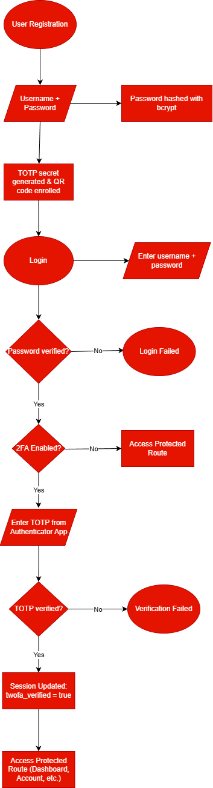

# Two-Factor Authentication (2FA) Using TOTP
**Author:** Lampros Chalatsis, Konstantinos Pogelis  
**Course:** Cryptography and Security  
**Professor:** Marek Ogiela  
**Date:** December 2025

## Introduction
Two-factor authentication (2FA) is an identity and access management method that adds a crucial security layer by requiring two different proofs of identification to access resources and data. It helps prevent cybercriminals from stealing users’ identities or accessing accounts, even when passwords have been compromised.  

Passwords alone are often insufficient to secure user accounts due to risks such as phishing, credential reuse, and brute-force attacks. This project implements a 2FA system that combines passwords with time-based one-time passwords (TOTP), demonstrating how cryptographic primitives like bcrypt hashing and HMAC-based OTP generation are applied in real-world authentication systems.

## Motivation / Problem Statement
We chose 2FA because it mitigates the major risks associated with password-only authentication, demonstrates practical use of cryptography, and is widely adopted as a standard in secure authentication practices.  

Traditional password-based authentication is vulnerable to security risks such as password reuse across multiple websites, phishing attacks, and brute-force attempts. These vulnerabilities can lead to unauthorized access, data breaches, and loss of sensitive information. There is a need for a more secure authentication process that increases user account protection without reducing usability. This project addresses this problem by implementing 2FA using TOTP, providing an additional layer of security beyond standard passwords.

## Objectives
- **Implement secure user registration and login using bcrypt**  
  Passwords are hashed with bcrypt to ensure that even if the database is compromised, attackers cannot recover the original passwords.  

- **Generate and store per-user TOTP secrets for 2FA**  
  Each user has a unique secret key used to generate time-based OTPs, ensuring that the second factor is personal and secure.  

- **Enable QR-code enrollment for authenticator apps**  
  Users can scan a QR code with an app like Google Authenticator to easily and securely enroll their 2FA secret.  

- **Verify TOTP codes during login**  
  Ensures that only users who provide the correct OTP in addition to their password can access protected resources.  

- **Protect routes using middleware**  
  Middleware enforces authentication and 2FA verification across protected routes, centralizing access control and improving security.  

- **Explain the cryptography behind password hashing and TOTP**  
  Demonstrates understanding of how adaptive hashing, HMAC, and time-based OTPs contribute to secure authentication systems.

## Project Architecture / Flow

The project is organized into the following structure:
```text
src/
├── server.js        # Application entry point
├── db.js            # SQLite database initialization
├── routes/
│   ├── auth.js      # Registration and password-based login
│   └── twofa.js     # TOTP enrollment and verification
├── middleware/
│   └── authCheck.js # Authentication and 2FA enforcement
└── views/
    ├── login.html
    ├── register.html
    ├── verify-2fa.html
    └── dashboard.html
```


### Authentication Flow

1. **Registration**: User submits username and password. Password is hashed using bcrypt and stored in the database.  
2. **Login**: User enters credentials. Password is verified using bcrypt.  
3. **2FA Verification**: If enabled, the user is prompted to enter a TOTP from their authenticator app.  
4. **Middleware Check**: Protected routes are accessible only if the user has successfully logged in and, if required, verified 2FA.  
5. **Access Granted**: The user can access the dashboard or other protected resources.

  

---

## Implementation Details

### Password Hashing

User passwords are protected using the bcrypt hashing algorithm. During registration, each password is hashed with a unique salt and a configurable number of salt rounds before being stored in the database. This ensures that plaintext passwords are never stored or transmitted.

Bcrypt is a cryptographic hash function designed for password hasing and safe storing in the backend of applications. It runs a complext hashing process, during which a users password is transformed into a fixed-length thread of characters. It uses a one-way hash function, which means that once the passwords is hashedm it can't be reversed to its original form. Every time a user log into their account, bcrypt hashes their passwords again and compares the new hash values stored in the system's memory to check if the passwords match.

Instead of simply hashing the given password, bcrypt adds a random piece of data, called salt, to create unique hash that is almost impossible to break with automated guesses during brute force attacks.

Additionally, bcrypt uses a configurable cost factor, known as salt rounds, which increases the computational effort required to compute each hash. This significantly slows down brute-force and dictionary attacks, making large-scale password cracking impractical even if the database is compromised.

### Session Management

Session management is the process of securely maintaining a user’s authentication state across multiple requests in a web application, despite the stateless nature of the HTTP protocol.

In this project, session management is used to track whether a user has successfully authenticated with a password and, if enabled, completed two-factor authentication. After successful verification, a server-side session is created to store the user’s identity and authentication status, allowing access to protected routes without repeatedly transmitting credentials.


### TOTP Enrollment and Verification
### Middleware-Based Access Control
### Database Design Considerations


